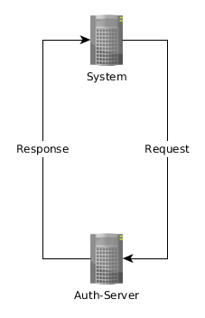

[](https://travis-ci.org/coffeenet/coffeenet-auth)

# CoffeeNet Auth Server

The CoffeeNet Auth Server is an OAuth2 provider to achieve single sign-on for the CoffeeNet. 
It authenticates against a LDAP-Server. See [how to configure LDAP](#ldap)
To use the Auth-Server in your application, see [README of CoffeeNet Starter Security](https://github.com/coffeenet/coffeenet-starter/tree/master/coffeenet-starter-sso).

## Endpoints

### User Endpoint

`/user` (Endpoint to retrieve user details)

#### Request
A [access token](#access-token) is needed to get the user details via `/user?access_token=${access_token}`

#### Response

Response for **human user**:
```json
{
"id":"${username}",
"name":"${username}",
"email":"${email}",
"clientOnly":false,
"principal": {
    "mail":"${email}",
    "authorities":[],
    "username":"${username}"
    }
}
```

Response for **technical user**:
```json
{
"id":"${username}",
"name":"${username}",
"clientOnly":true,
"principal": "${username}"
}
```


### Authorization Endpoint

`/oauth/authorize` (User authorizes client to access the user endpoint)


### Token Endpoint

`/oauth/token` (Used to get an access token. See [access token](#access-token))


## Create a new OAuth2 Client

A user with the role `COFFEENET-ADMIN` is able to create a new client at `http(s)://$host/clients/new`.


## Access Token

### What an access token is for

The access token in CoffeeNet is used to retrieve user/clientdetails from the Auth-server.


1. System requests content of a CoffeeNet App with an access token.
    (Header: `Authorzitation: Bearer $accessToken`)

2. CoffeeNet App uses access token to retrieve client details from Auth-Server

3. Auth-Server resolves access token to client details and provides them to the CoffeeNet App

4. CoffeeNet App provides content based on the returned client details

### How to get an access token

There are multiple ways to obtain an access token. In all of them the
 Resource Owner(User) has to grant the application the access to this token.

The CoffeeNet Auth-Server provides the following grant types:
* Authorization Code Grant (Used by web apps i.e. most CoffeeNet Apps)
* Password Grant
* Client Credentials Grant

#### Authorization Code Grant

The most common used grant type is the authorization code grant 
type, since it's the flow that is used for web apps that redirect the 
user to the authorization server to obtain the token.
This flow is the flow you see for example when you visit the coffeenet 
frontpage.


1. User navigates to CoffeeNet App 
2. CoffeeNet App checks if session is available for this user 
    * YES: continue with step 13
    * NO: continue with step 3
3. CoffeeNet App sends redirect to Auth-Server (client-id, redirect uri 
in parameters)
4. Auth-Server checks if session is available for this user
    * YES: continue with step 7
    * NO: continue with step 5
5. Auth-Server asks User to enter credentials (Login Form)
6. User enters credentials
7. Auth-Server sends redirect back to redirect uri (should be the address
        of the CoffeeNet App) containing an authorization code in parameters. 
        Users won't event notice this step, if a on auth-server session 
        already exists.
8. CoffeeNetApp requests token with the given authorization code and its
        client credentials (meaning client-id and client-secret).
9. Passes the access and refresh token back to the CoffeeNet App
10. CoffeeNet App requests user details from Auth-Server with the obtained 
        access token.
11. Auth-Server passes user details back to the CoffeeNet App
12. CoffeeNet App Stores user details in a session
13. CoffeeNet App provides content based on the user details


#### Password Grant

This grant type is typically used by developers for testing purpose or systems.


##### Request
System or Developer requests (post) an access token. Request contains:
* ClientId + ClientSecret as basic auth **header**:

    `Authorization: basic base64(ClientId:ClientSecret)`

* Grant type, username, password and scope in the **body**:

    `grant_type=password&username=$username&password=$password&scope=openid`

with header `Content-Type: application/x-www-form-urlencoded`

##### Response
Auth-Server provides access token if username, password, clientId and
clientSecret are correct.

Response looks like this:
```json
{
  "access_token": "6b311332-f57c-3ee2-a668-57c1db083a5p",
  "token_type": "bearer",
  "expires_in": 42837,
  "scope": "openid"
}
```


#### Client Credentials Grant

This grant type is typically used by systems. They request their access token
from the Auth-Server and use it as authentication information for requests to
any CoffeeNet App.



##### Request
System requests (post) an access token. Request **must** contain:

* ClientId + ClientSecret as basic auth **header**:

    `Authorization: basic base64(ClientId:ClientSecret)`

* Grant type and scope in the **body**:

    `grant_type=client_credentials&scope=openid`

with header `Content-Type: application/x-www-form-urlencoded`


##### Response
Auth-Server provides access token if clientId and clientSecret are correct.

Response looks like this:

```json
{
  "access_token": "6b311332-f57c-3ee2-a668-57c1db083a5p",
  "token_type": "bearer",
  "expires_in": 43189,
  "scope": "openid"
}
```

## Configuration

### Developer Mode

The Auth-Server can be started in developer mode by setting the property `auth.development` to `true`.
By doing this, a default client is created during startup. 
This client can be used to test your application with integration into the Auth-Server.

Details of the default client:

```yaml
clientId: coffeeNetClient
clientSecret: coffeeNetClientSecret
```

This can be used in none production environments for testing purposes.

### Json Web Token (JWT)

JWT can be signed asymmetrical and the private key will be saved in
the Java KeyStore (JKS).

```yaml
auth:
  keystore:
    enabled: true
    jksPassword:
    jksAlias: 'coffeenet'
    jksPath: 'file:coffeenet.jks'
```

The JKS is enabled by default. Just provide the path to your jks file
that can created with the following command:

```bash
keytool -genkeypair -alias ${alias} -keyalg RSA -dname "CN=jwt, L=${L}, S=${S}, C=${DE}" -keypass ${yourSecret} -keystore ${myKeystore.jks} -storepass ${yourSecret}
```

e.g.

```bash
keytool -genkeypair -alias coffeenet -keyalg RSA -dname "CN=jwt, L=Berlin, S=Berlin, C=DE" -keypass changeit -keystore coffeenet.jks -storepass changeit
```

The `auth.keystore.jksPath` property:
* Must support fully qualified URLs, e.g. "file:C:/test.dat".
* Must support classpath pseudo-URLs, e.g. "classpath:test.dat".
* Should support relative file paths, e.g. "WEB-INF/test.dat".
  (This will be implementation-specific, typically
  provided by an ApplicationContext implementation.)


### LDAP
To configure the connection to your LDAP-Server just set the following properties inside your `application.yml`.
This example shows the properties to connect with the LDAP-Server provided by our docker container.

```yaml
auth:
  ldap:
    url: ldap://localhost:38900
    base: dc=coffeenet
    userSearchBase: ou=People
    userSearchFilter: uid={0}
    groupSearchBase: ou=Groups
    groupSearchFilter: member={0}
```

### Database

Specify the following properties inside your `application.yml`. 
The following example is configures the application to use the mysql database provided by our docker container.

```yaml
spring:
  datasource:
    url: jdbc:mariadb://localhost:3306/${database}
    driver-className: com.mariadb.jdbc.Driver
    username: ${username}
    password: ${password}
    data: ${pathToData.sql}
```

### Logging

Logging is provided by [CoffeeNet Logging](https://github.com/coffeenet/coffeenet-starter/tree/master/coffeenet-starter-logging) and can be configured by setting
properties below `coffeenet.logging.*` inside your `application.yml`.

### Service Discovery

The Auth-Server uses [Coffeenet Service Discovery](https://github.com/coffeenet/coffeenet-starter/tree/master/coffeenet-starter-discovery) and is only visible to users with the role `COFFEENET-ADMIN`.  
